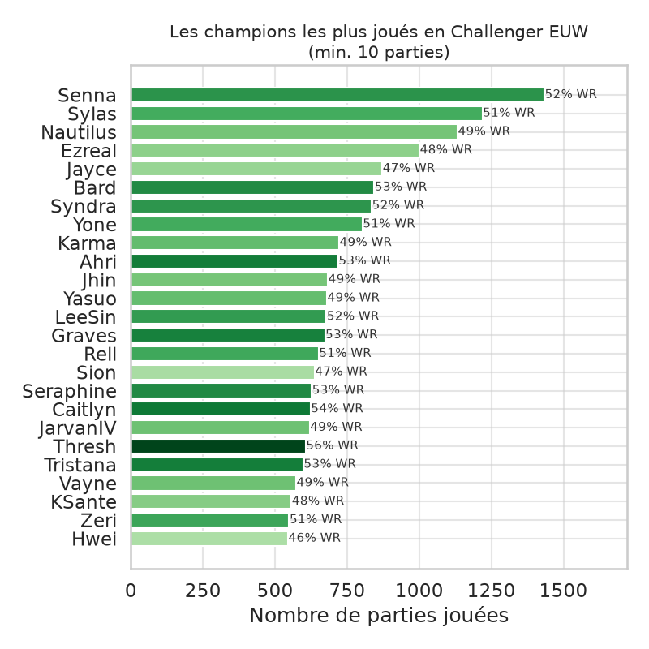
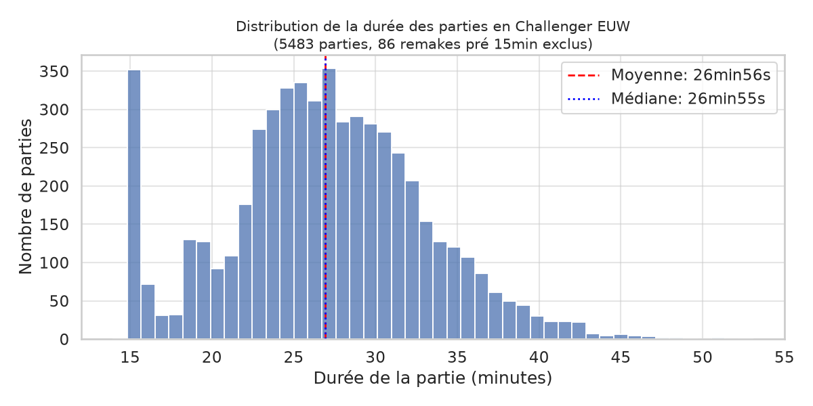
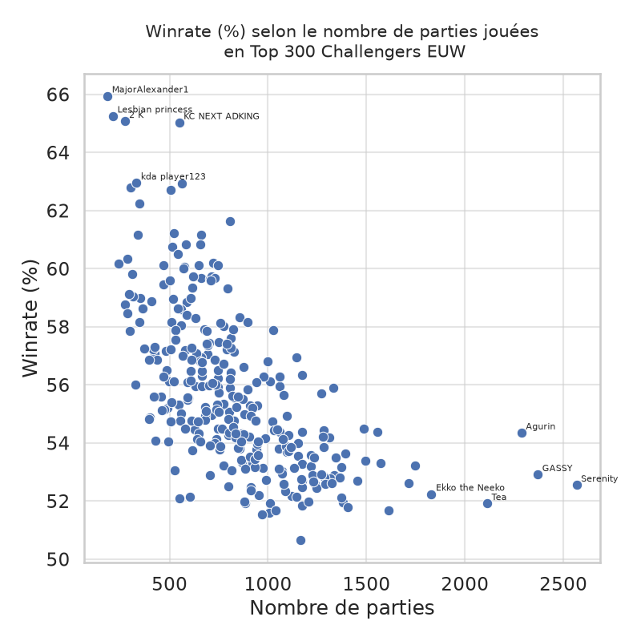
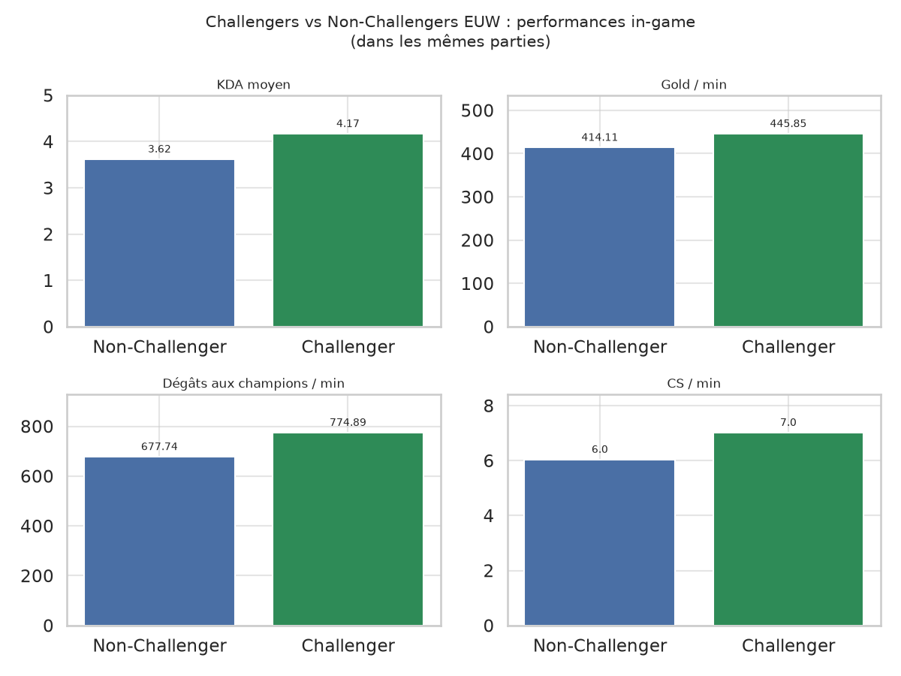
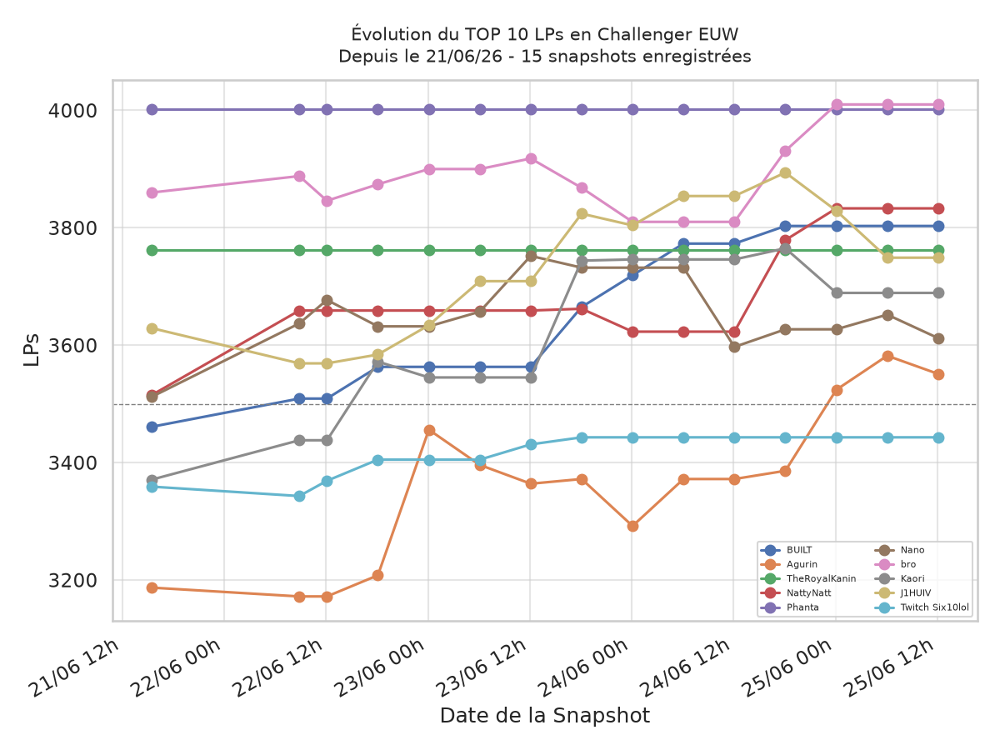
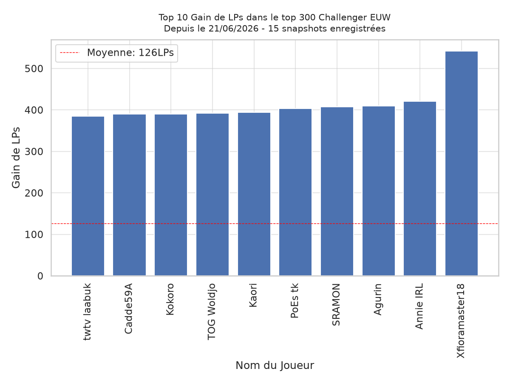

# Challenger Ladder Stats

Projet personnel d'introduction à la data.  
**L'idée** : construire un pipeline complet de A à Z : collecte, stockage, nettoyage et visualisation sur un sujet que je connais bien, League of Legends.

Le pipeline suit les joueurs du tier Challenger EUW (les ~300 meilleurs joueurs du serveur) via l'API Riot Games, stocke le classement et performances individuelles dans les parties en SQLite, et le test de réaliser des analyses.

**Stack** : Python, pandas, SQLite, matplotlib, seaborn  
**Highlights** : rate limiter contraintes API,  retry, vérif duplication avant fetch

## Contexte

**League of Legends (LOL)** est un jeu compétitif en équipe (5v5) où les joueurs progressent dans un système de classement par paliers. Le tier **Challenger** est le plus haut palier existant, regroupant les ~300 meilleurs joueurs de chaque serveur régional.

Les **League Points (LPs)** mesurent la progression dans ce classement. 

Le **winrate** est le pourcentage de parties gagnées. 

Le **KDA** (Kills/Deaths/Assists) mesure la performance individuelle en combat. 

Le **CS** (Creep Score) comptabilise les unités ennemies tuées pour générer des ressources économiques (**GOLD**), qui servent à acheter des équipements améliorant le champion.

Chaque joueur incarne un **champion** (personnage aux capacités uniques) sur l'un des 5 **rôles** du jeu : Top, Jungle, Mid, ADC et Support.

## Données collectées

**~300 joueurs** suivis en continu, **5 400+ parties** analysées, **15 snapshots** de classement sur la période.  
Collecte toutes les 6h via l'API Riot Games, stockée dans une base SQLite relationnelle (4 tables).

## Visualisations

### Champions "Meta" : popularité & winrate


Senna domine le pick rate (1434 parties, 52% WR). Thresh est le meilleur pick du top 20 avec 57% de winrate sur un volume significatif (606 parties). Hwei à l'inverse concentre beaucoup de parties pour un petit 46% signe d'un champion sur-joué malgré peut-être de mauvaises stats sur ce patch.

---

### Distribution de la durée des parties


Moyenne et médiane quasi égales (26min56s et 26min55s) : la distribution est quasi-symétrique. Les parties Challenger sont globalement courtes, cohérent avec un niveau de jeu qui accélère la prise de décision. 

On a aussi autant de parties finies dans le temps moyen que de parties finies à 15 minutes qui sont dans 95% des cas un abandon, pour cause, les joueurs de haut niveau comprennent très bien leurs conditions de victoires/défaites.

---

### Grind vs Performance


Scatter plot croisant nombre de parties jouées et winrate par joueur Challenger. Permet de distinguer les joueurs qui grindent beaucoup de ceux qui sont efficaces, les deux ne coïncident pas forcément.

---

### Challengers vs Non-Challengers : performances in-game


Dans chaque partie Challenger, les participants non-trackés (coéquipiers et adversaires hors top 300) servent de groupe de comparaison. Les Challengers font en moyenne +14% de dégâts/min et +7% de gold/min et +1cs/min dans exactement les mêmes conditions de jeu.

---

### Évolution des LP Top 10 joueurs actifs


Évolution des League Points (LPs) sur la période de collecte (15 snapshots). On y voit clairement les joueurs en progression, ceux stables, et la densité de la course aux positions intermédiaires.

---

### Meilleures progressions sur la période


Classement des joueurs ayant gagné le plus de LP entre le premier et le dernier snapshot. Fenêtre courte (quelques jours). Ce graphe s'enrichira avec la durée de collecte.

---

## Data quality & corrections

**Exclusion des parties invalides**  
Les remakes et parties interrompues ont été exclus via un filtre sur la durée de 10 min. Une partie classique en Challenger ne peut mécaniquement pas se terminer en dessous de ce seuil.

**CS/min : neutralMinionsKilled manquant (corrigé en v0.0.3)**  
Le calcul initial de CS/min n'incluait que `totalMinionsKilled` (lane CS), sans `neutralMinionsKilled` (camps jungle). Résultat : CS/min sous-estimé pour la jungle et les laners en late game. 
Correction appliquée via un script de migration sur les 4 526 matchs existants sur l'instant T.

---

## Prérequis 
Nécessite une clé API Riot Games, le chemin de votre database SQLite en `.db` dans un fichier `.env` :
```
RIOT_API_KEY=...
DB_PATH=...
```
**!! Attention !!** N'oubliez pas de créer un fichier `.db` qui correspond au `DB_PATH` du `.env` pour le bon fonctionnement

## Lancer via Docker
Pour lancer le pipeline, via Docker, n'oubliez pas d'être dans le répertoire de travail pour avoir les bons volumes montés.

```bash
# Récupère la version la plus récente du package
docker pull ghcr.io/lunaytik/challenger-ladder-stats:latest
# Lance le conteneur en one-shot récupère le .env et fait le lien entre les logs/la database local et monté
docker run --rm --env-file .env -v $(pwd)/logs:/app/logs -v $(pwd)/database.db:/app/database.db ghcr.io/lunaytik/challenger-ladder-stats:latest
# OU Image en local
docker build -t IMAGE-NAME .
docker run --rm --env-file .env -v $(pwd)/logs:/app/logs -v $(pwd)/database.db:/app/database.db IMAGE-NAME
```

## Lancer en local

Projet réalisé avec `uv 0.11.23`

```bash
uv sync
uv run python main.py
```


